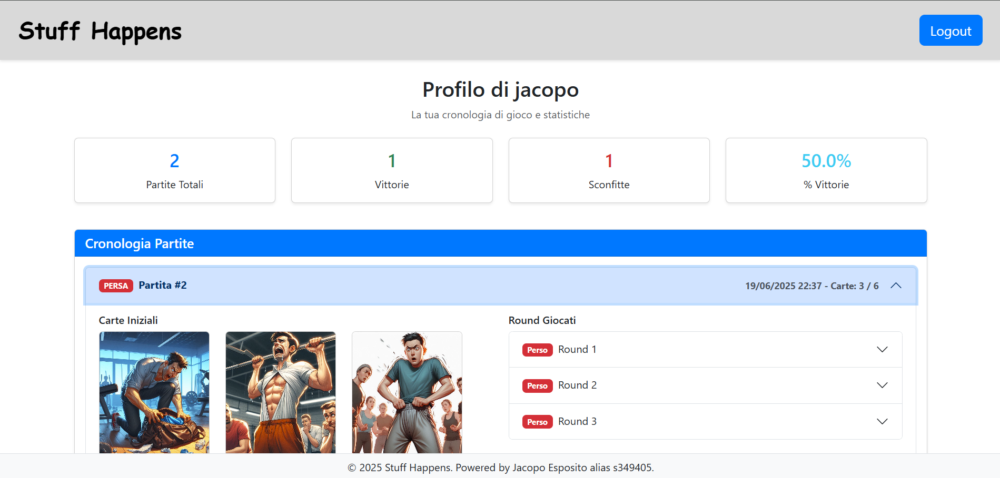
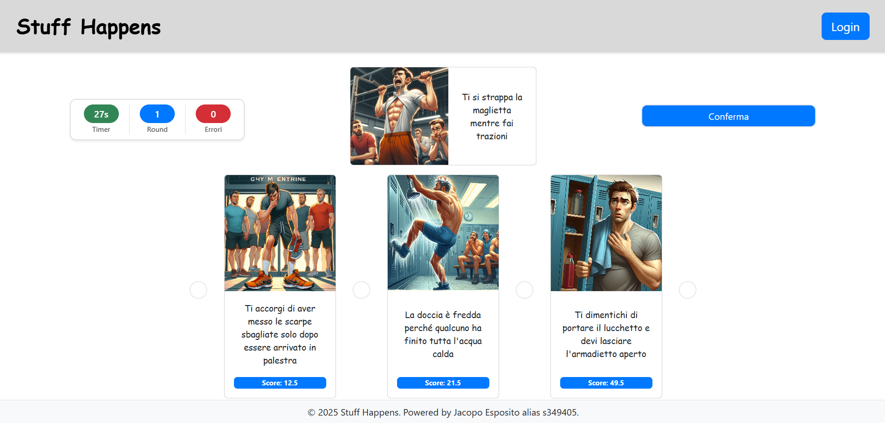

[](https://classroom.github.com/a/uNTgnFHD)
# Exam #1: "Gioco della Sfortuna"
## Student: s349405 Esposito Jacopo 

## React Client Application Routes

- Route `/`: Pagina principale che mostra il menu con opzioni per visualizzare le regole, giocare una demo, iniziare una partita completa (per utenti autenticati) o visualizzare la cronologia
- Route `/rules`: Pagina delle regole che spiega come giocare al "Gioco della Sfortuna"
- Route `/game`: Pagina di gioco completa per utenti autenticati, permette di giocare partite complete
- Route `/demo`: Pagina di gioco demo per utenti anonimi, permette di giocare una partita di un round
- Route `/history`: Pagina cronologia partite per utenti autenticati, mostra tutte le partite completate con le relative statistiche
- Route `/*`: Pagina nel caso in cui si chiami una route non esistente

## API Server

- POST `/api/sessions`
  - corpo richiesta: 
    ```
      { 
        username: string, 
        password: string 
      }
    ```
  - corpo risposta: oggetto utente 
    ```
    { 
      id_user: number, 
      username: string 
    }
    ```
  - descrizione: Endpoint per il login dell'utente

- GET `/api/sessions/current`
  - corpo risposta: oggetto utente corrente
    ```
      { 
        id_user: number, 
        username: string 
      }
    ```
  - descrizione: Ottiene le informazioni dell'utente autenticato

- DELETE `/api/sessions/current`
  - descrizione: Endpoint per il logout dell'utente

- POST `/api/game`
  - corpo richiesta:
     ```
    { 
      demo: boolean 
    }
    ```
  - corpo risposta: 
    ```
    { 
      id_game: number, 
      initialCards: Card[], 
      currentCard: Card, 
      demo: boolean 
    }
    ```
  - descrizione: Inizia una nuova partita (demo o partita completa per utenti autenticati)

- PATCH `/api/game/:id_game/status`
  - descrizione: Aggiorna lo stato del gioco (richiede autenticazione)

- GET `/api/user/:id_user/games`
  - corpo risposta: array di partite completate con round e carte
    ```
    { 
      games: Games []
    }
    ```
  - descrizione: Ottiene la cronologia delle partite per un utente specifico (richiede autenticazione)

- POST `/api/game/:id_game/round`
  - corpo richiesta: 
    ```
    { 
      id_card: number, 
      nround: number, 
      status: number 
    }
    ```
  - corpo risposta: 
    ```
    { 
      id_round: number
    }
    ```
  - descrizione: Aggiunge un round alla partita corrente (richiede autenticazione)

- GET `/api/card/random`
  - parametro query: `id_game`
  - corpo risposta: oggetto carta casuale 
    ```
    { 
      id_card: number, 
      caption: string, 
      image_path: string 
    }
    ```
  - descrizione: Ottiene una carta casuale per la partita corrente

- GET `/api/card/:id_card`
  - corpo risposta: punteggio carta 
    ```
    { 
      score: number 
    }
    ```
  - descrizione: Ottiene il punteggio di una carta specifica

## Database Tables

- Table `Users` 
  - id_user (CHIAVE PRIMARIA)
  - username 
  - password (password crittografata)
  - salt (sale utilizzato per la crittografia della password)

- Table `Cards` 
  - id_card (CHIAVE PRIMARIA)
  - caption 
  - image_path 
  - score 

- Table `Games` 
  - id_game (CHIAVE PRIMARIA)
  - id_user (CHIAVE ESTERNA)
  - status (1 = vinta, 2 = persa)
  - date (data di completamento della partita)

- Table `Rounds` 
  - id_round (CHIAVE PRIMARIA)
  - id_game (CHIAVE ESTERNA )
  - id_card (CHIAVE ESTERNA )
  - guessed (1 = indovinato correttamente, 2 = indovinato erroneamente)
  - round_number (0 per le carte iniziali, 1+ per i round di gioco effettivi)

## Main React Components

- `Home` (in `Home.jsx`): Pagina principale con carte di navigazione per accedere alle regole del gioco, giocare una demo, iniziare una partita completa o visualizzare la cronologia (se autenticati)
- `Game` (in `Game.jsx`): Componente principale del gioco che gestisce sia la modalità demo che quella completa, gestisce lo stato del gioco, il timer, il posizionamento delle carte e la progressione dei round
- `DefaultLayout` (in `DefaultLayout.jsx`): Layout principale che fornisce l'header di navigazione, i modal di autenticazione e una struttura di pagina coerente
- `NavHeader` (in `NavHeader.jsx`): Barra di navigazione con funzionalità di login/logout 
- `AuthComponents` (in `AuthComponents.jsx`): Componente modal per il login che gestisce l'autenticazione dell'utente
- `History` (in `History.jsx`): Pagina cronologia che mostra le partite completate con dettagli espandibili di tutte le carte e i round
- `Rules` (in `Rules.jsx`): Pagina di spiegazione delle regole del gioco per aiutare gli utenti a capire come giocare
- `Timer` (in `Timer.jsx`): Componente timer con conto alla rovescia utilizzato durante i round di gioco (30 secondi per round)
- `MyCard` (in `MyCard.jsx`): Componenti per la visualizzazione delle carte del giocatore in diversi orientamenti e contesti
- `GamesModal` (in `GamesModal.jsx`): Componenti modal per l'inizio del gioco, le transizioni tra round e le schermate di fine partita

## Screenshot




## Users Credentials

- jacopo (username), jaja (password) (con 1 partita vinta e due perse)
- giuseppe (username), peppe (password)
